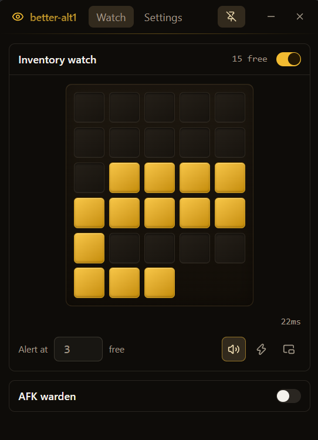

# better-alt1

An Alt1-style companion for RuneScape 3: a small always-on-top-able desktop app that
reads the pixels already on your screen and tells you when something needs your
attention — nothing more.

<p align="center">
  
</p>

**It observes. It never acts.** No synthetic keyboard or mouse input, no game process
memory, no packet interception, no modified client. That passive-observer model is what
makes Alt1-style tools acceptable, and it is enforced in this repo by an automated
compliance scan (`pnpm lint:compliance`) that fails the build if a forbidden API so much
as appears in the source. The on-game overlay is click-through by construction — it
cannot intercept a single click meant for the game.

## Honesty section

- This project is **fully vibe-coded**: written almost entirely by AI (Claude Code),
  with a human deciding what to build, reviewing what matters, and playtesting the
  result. Read the code with that in mind.
- It exists to fill a gap, and it expects to die: when official plugin support ships in
  the client, this repo will most likely be archived in its favor.
- It's a personal tool that happens to be public. Issues are welcome;
  [pull requests are not accepted](CONTRIBUTING.md) and are closed automatically.

## Features

- **Inventory watch** — finds your inventory on screen by itself (no coordinates, no
  calibration, works with items in it), then alerts before it fills. Click a slot to
  ignore permanent residents like a coin pouch. Optional gold highlight frame drawn over
  the game so you can see exactly what it watches.
- **AFK warden** *(coming soon — built, still being tested against real play)* — select
  an area (your XP counter is ideal) and get an alarm when it stops changing: you
  stopped skilling, the spot moved, a dialog is up.
- **Alerts that reach you** — a two-tone bell and a taskbar flash; both work while you
  are alt-tabbed.
- Compact, pinnable window that stays out of the way.

## Install

Grab the latest `.msi` from [Releases](../../releases). The binary is currently
unsigned, so Windows SmartScreen will warn on first run — choose **More info → Run
anyway**. After that the app updates itself: it checks for a new release at launch and
offers a one-click install.

### Known limitations

- **Windows only.** Capture behaviour and performance are measured and tuned on Windows.
- Inventory auto-detection is tuned against the default RS3 interface theme with an
  opaque interface. Heavy transparency makes empty slots harder to read — raise "Empty
  sensitivity" in Settings if slots misread.
- The app icon is still the stock Tauri icon (TODO).

## Contributing

**Issues only.** Bug reports and feature ideas are genuinely appreciated; external pull
requests are auto-closed. [CONTRIBUTING.md](CONTRIBUTING.md) explains why and what to do
instead.

## Development

pnpm 11 workspaces · TypeScript · oxlint · Rust + Tauri 2 · React 19 · Vite 8 ·
Tailwind 4 · shadcn/ui · TanStack Router / Query / Form.

Prerequisites: Node 22+, pnpm 11, Rust (stable, MSVC toolchain on Windows) and a C++
toolchain — on Windows, VS 2022 Build Tools with the "Desktop development with C++"
workload.

```sh
pnpm install
pnpm dev          # vite + tauri dev
pnpm check        # lint + compliance + typecheck + vitest
cargo test --manifest-path apps/desktop/src-tauri/Cargo.toml
```

Releases are cut from the Actions tab (`release` workflow): pick a version bump and it
bumps every manifest, tags, builds, signs the updater artifact, and publishes the
GitHub Release that installed apps auto-update from.

Features that exist but haven't earned a release yet are gated in
`apps/desktop/src/lib/features.ts` — on in dev builds, "coming soon" in release builds,
force-on with `VITE_FEATURE_*=1` at build time.

| Path                  | What                                                      |
| --------------------- | --------------------------------------------------------- |
| `apps/desktop`        | Tauri app — React frontend, Rust capture/analysis backend |
| `packages/core`       | Framework-free primitives: geometry, frames, pixel access |
| `packages/plugin-sdk` | The API surface plugins are written against               |
| `scripts`             | Repo tooling, including the compliance scan               |

Tests run against **golden fixtures** — real frames captured from a running client and
committed under `fixtures/`, so analysis code is verified against actual game pixels.
Capture a new one while the game is running:

```sh
pnpm fixture rs-client --target runescape --region 2900,1500,320,180
```

Debug the inventory detector against a capture:

```sh
cargo run --manifest-path apps/desktop/src-tauri/Cargo.toml --bin detect-debug -- fixtures/rs-slots.ba1f
```

Frames cross the IPC boundary as raw bytes behind a 24-byte little-endian header
(magic `BA1F`, version, pixel format, width, height, capture timestamp) followed by
top-down RGBA8 rows. The writer is `src-tauri/src/capture.rs`; the reader is
`packages/core/src/frame.ts`. Change one, change the other.

## License

[MIT](LICENSE)
